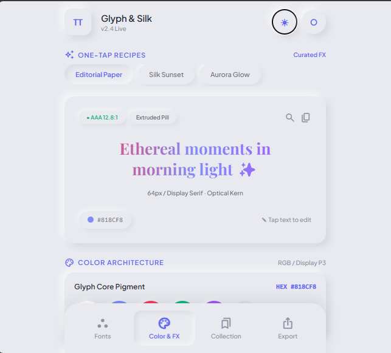
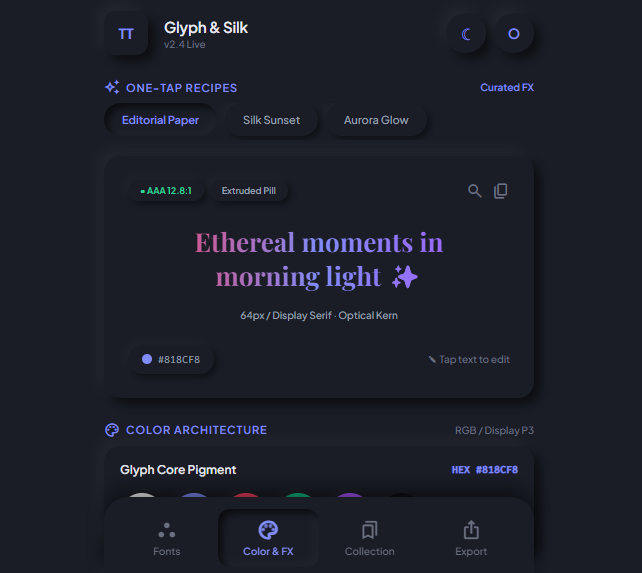

# Glyph & Silk

A typography playground with 3 pages — **Fonts**, **Color & FX**, and **Collection** — built with a custom **Neomorphic / Soft UI** design system that supports **both light and dark themes**.


---

## ✨ What Was Modified

### 1. Unified Design System

All three pages now share the **same CSS variables** and **same neomorphic visual language**:

| Token              | Light           | Dark           |
| ------------------ | --------------- | -------------- |
| `--surface-base`   | `#e8eaf0`       | `#1a1d26`      |
| `--surface-raised` | `#e8eaf0`       | `#1a1d26`      |
| `--text-primary`   | `#2a2d3a`       | `#e8eaf0`      |
| `--primary`        | `#6366f1`       | `#818cf8`      |
| `--shadow-raised`  | soft dual light | deep dual dark |
| `--shadow-inset`   | inset light     | inset dark     |

**Rules followed (per `DESIGN.md`):**

- ✅ Same surface color for all elements
- ✅ No borders (breaks neomorphism)
- ✅ No gradients (except intentional preview text)
- ✅ Minimum 12px border radius
- ✅ Raised vs Inset shadows only
- ✅ Plus Jakarta Sans throughout

### 2. Theme Switching (Auto + Manual)

- 🌗 **Auto-detects** device theme on first visit
- 👆 **Manual toggle** with the ☾ / ☀ button
- 💾 **Remembers** the user's choice via `localStorage`
- 🔄 **Follows live** system changes if no choice is saved

### 3. Files Updated

| File                   | Change                       |
| ---------------------- | ---------------------------- |
| `style.css`            | Light + Dark theme variables |
| `styleTheme.css`       | Light + Dark theme variables |
| `styleCollection.css`  | Light + Dark theme variables |
| `script.js`            | Shared theme manager         |
| `index.html`           | Added Fonts page structure   |
| `indexTheme.html`      | Color & FX page              |
| `indexCollection.html` | Collection & Vault page      |

### 4. UI Improvements

- Replaced emoji icons with **Material Symbols**
- Fixed nav active states with **inset shadow**
- Added **smooth 0.3s transitions** on theme switch
- Standardized spacing with CSS variables
- Removed all borders and gradients

---

## 🖼️ Screenshots

### Light Theme



### Dark Theme



---

## 🚀 How to Use

1. Clone the repo

```bash
git clone https://github.com/safariousman02-byte/BUILDING-A-STYLISH-TEXT-WEB-APP.git
```

2. Open index.html in your browser

3. Click the ☾ / ☀ button to switch themes
